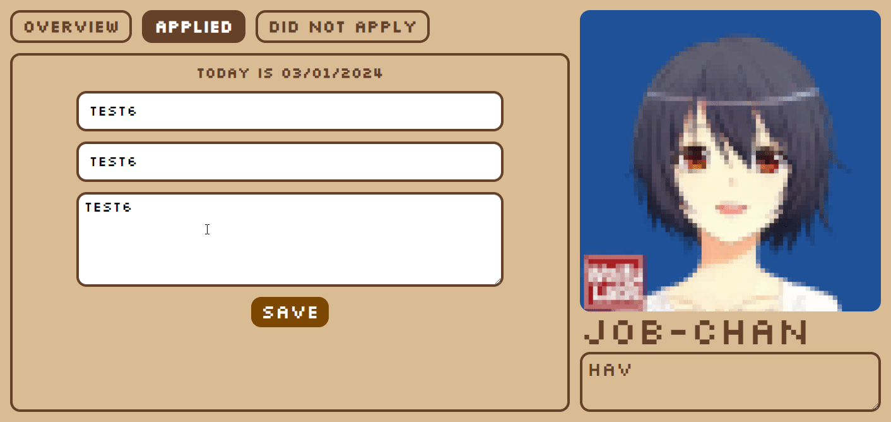
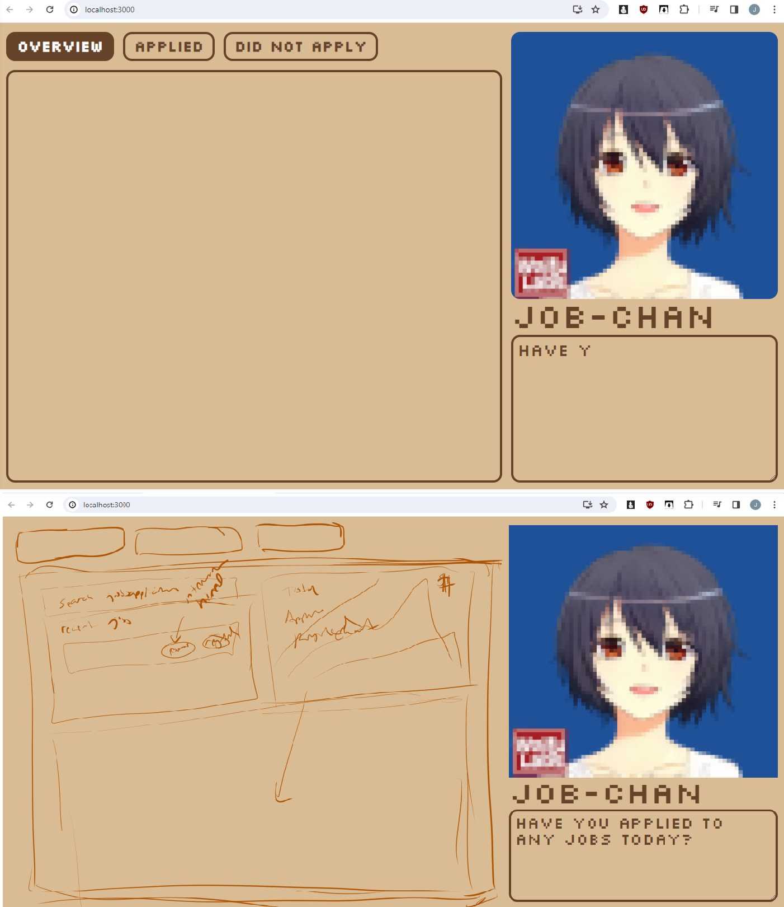
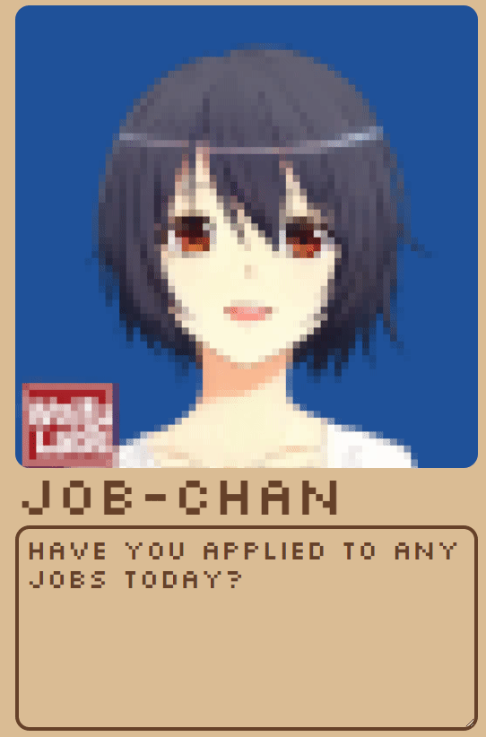
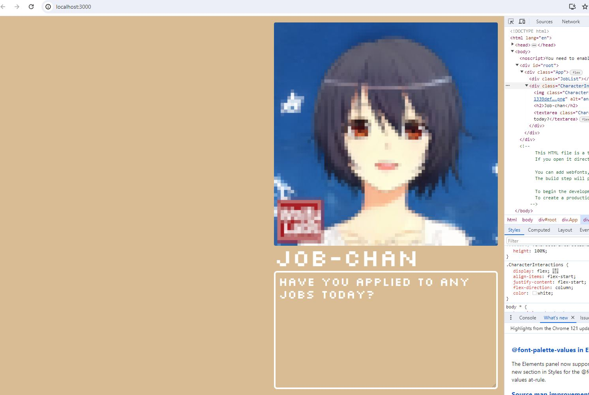
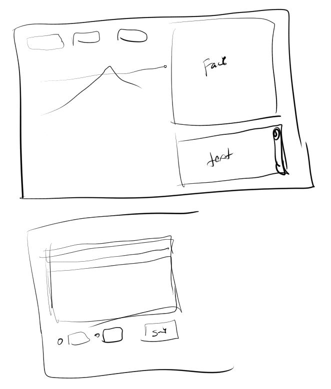

03/01/2024

6:56 PM

Gonna add the API call, struggling, I'm tired AF same old

7:22 PM

There... ability to add

I have to add a script to import the existing job apps I saved in google spreadsheet

Don't know if I'll do that today... I still have 30 mins I could keep going

Would be nice to have all of it/have a counter

---

02/29/2024

5:58 PM

Alright free from mental prison

I'm gonna add the three tabs (Overview, Applied, Did Not Apply)

The Overview is a dashboard/charts view and the other two are dedicated purpose forms

I want to see total number of jobs I've looked at

Then applied, rejected, I think that means 3 lines on a chart

Today is a Monday for me which are the worst (oversleep reset) so I had I think 4 hrs of sleep max last night

I feel like I can code though

6:52 PM

Damn I'm tired as hell

Can see where I'm at

I want to add the insert calls at least

I did see how the overview/dashboard could look

6:54 PM

Break for now till later when I eat, maybe have more energy

Let me bridge the two forms so they work

10:16 PM

No... tired, also I didn't make it with the applied or not format... it could still be 1 table

Oh okay so seed has a `why_not_apply`column so if that's blank then I must have applied

10:18 PM

I can finish this tomorrow, it's close

I'm just tired, will use the spreadsheet

---

02/28/2024

This is still not done

I've recently eaten, near end of day, donated plasma... I feel pretty mentally beat

Alright let me do some things before today is over... I gotta back to my mental prison (labor job)

8:54 PM

This looks so bad... I'm not an artist

9:13 PM

Added animated chars, it's not interactive though, I was intending it to be but what... write into it? Exact char match? What matters is the input form on the left/charts.

---

02/26/2024

5:38 PM

I don't feel great right now, I slept in but also donated plasma 3 hrs ago

I did not eat right away afterwards... should have

But I mentally feel spent already which sucks but if I do the donation earlier it's faster (less waiting)

Got a bite from a recruiter but it's some nice tech and I don't 100% hit all the req so doubtful that'll go anywhere

Only positive is for once in a long time I have a tax refund that'll give me some padding since every month right now I'm short $1.5K in bills lmao

Somehow I've gotten by the last 3 months (I keep missing payments, late fees)

5:46 PM

I'm not really feeling it right now so I'll just animate the character, ugh... waste of time today damn

I did some work for a friend but it was not much

The mid-day interruption really does suck, supposed to have 3 whole days off but the extra money helps

02/23/2024

7:13 PM

Super tired today, gonna try and do something with this

5:57 PM

Damn I'm struggling

---

02/17/2024

6:07 PM

I ate a little extra on my 2nd break, I feel like I have more energy now we'll see

Going to make the basic API and seed DB

I have been applying, looked at like 50 some jobs applied to 3 lol damn

6:49 PM

I imagine this popup showing up on the bottom right of my desktop with the anime girl face on it

But I don't think I can do that, maybe a low res pixelated favicon

7:07 PM

I kind of see the app but I don't

So I'll vaguely make it, it'll be brown for some reason

7:14 PM

Oh yeah this time I'll be a good boy and separate the API code from the UI logic

7:27 PM

Got sidetracked by the graphics tablet not matching my ultrawide monitor's color profile ha

7:40 PM

This will have basic animation like blinking, moving

The text will come in 1 char at a time

This will be a desktop app, I had a speech bubble in mind, not too late but need to change the image

Oh yeah I did spend like 10 minutes trying to find some kind of face to use

This one is a good starting point where it has a neutral/happy face, then it's easy to make the face talk by changing mouth height and blinking is similar

I could probably crop the background, so the face can move with CSS (simulated breathing)

This was pixelized with Gimp 4px block size I believe or 8px

8:00 PM

Some good progress, I'll finish this maybe tomorrow or next day, I have a nice break coming up

---

02/15/2024

6:43 PM

So I don't have this fully designed in my mind.

I definitely want a database since I want that to persist better, be accessible by other things means need an API

I did this solar chan project and also this crypto desktop alert thing in the past, I'll combine those as mechanisms for this thing

https://github.com/jdc-cunningham/solar-chan (character and retro font)

https://github.com/jdc-cunningham/crypto-alerts-and-tools (desktop notification)

6:52 PM

It's a bit of work and after work I can't really code but all of this is trivial/stuff I've already done before

Pretty much I just want something that bugs me on my desktop and tells me to apply

I also want to track jobs I looked at but didn't apply to because not qualified

7:02 PM

Man I feel so spent mentally damn

Damn I guess I'll have to eat and then try

7:12 PM

I have an extra day off next week so I have time to work on this but will def apply to something.

job db schema

id, company, job_info, tech stack, applied_date, status, last_updated
